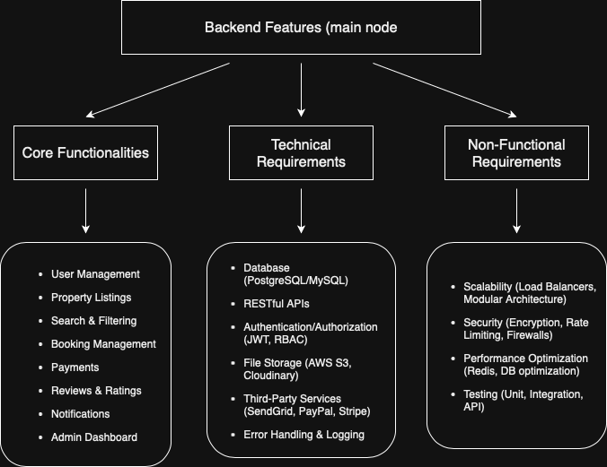

# alx-airbnb-project-documentation
Project is an Airbnb Clone, developed as part of a my journey in backend. The main objective is to replicate the core functionalities of Airbnb, including user authentication, property listings, booking management, and reviews. Through this project, I aim to strengthen my understanding of backend systems, APIs, databases, and frontend integration.

# Team Roles

### 1. Backend Developer
Responsible for building the server-side logic, APIs, and application architecture. They ensure that user requests (such as searching for listings, booking, and authentication) are processed securely and efficiently.

### 2. Frontend Developer
Focuses on creating the client-side interface where users interact with the platform. They implement responsive designs and integrate backend services into a seamless user experience.

### 3. Database Administrator (DBA)
Designs, manages, and optimizes the database system. The DBA ensures data integrity, security, and performance for storing user profiles, property listings, bookings, and reviews.

### 4. UI/UX Designer
Creates the overall look, feel, and usability of the application. They design intuitive user flows and interfaces to make sure the platform is easy and enjoyable to use.

### 5. Project Manager
Oversees the planning, coordination, and progress of the project. The project manager ensures tasks are completed on time, manages communication between team members, and aligns the project with its goals.

### 6. Quality Assurance (QA) Engineer
Tests the application to identify and fix bugs before release. QA engineers validate functionality, performance, and usability across devices and platforms.

### 7. DevOps Engineer
Handles deployment, continuous integration, and monitoring. They make sure the application runs smoothly in production, is scalable, and has reliable backup and recovery processes.

## Technology Stack

- **Django**: A high-level Python web framework used for building the backend and RESTful APIs. It provides robust tools for authentication, routing, and handling business logic.

- **PostgreSQL**: A powerful, open-source relational database used to store application data such as user profiles, property listings, bookings, and reviews.

- **GraphQL**: A query language for APIs that allows clients to request exactly the data they need. It improves efficiency in data fetching compared to traditional REST endpoints.

- **JavaScript (ES6+)**: Used for interactive features on the frontend and for connecting backend logic to user-facing components.

- **React (optional in later stages)**: A JavaScript library for building user interfaces. It allows for creating reusable, dynamic components and improves frontend scalability.

- **HTML & CSS**: Core technologies for structuring and styling the user interface, ensuring the platform is responsive and visually appealing.

- **Git & GitHub**: Version control and collaboration tools used for tracking changes in the codebase and managing project contributions.

- **Docker (future deployment)**: Containerization technology to package and deploy the application consistently across different environments.

- **Heroku / AWS (future deployment)**: Cloud platforms for deploying, scaling, and hosting the application in production.

## Database Design

### 1. Users
Represents individuals who can act as hosts (listing properties) or guests (making bookings).
- **id**: Unique identifier for each user.  
- **name**: Full name of the user.  
- **email**: User’s login email (unique).  
- **password_hash**: Encrypted password for authentication.  
- **role**: Defines if the user is a host, guest, or admin.  

**Relationships:**  
- A user can list multiple properties.  
- A user can make multiple bookings.  
- A user can leave multiple reviews.  

---

### 2. Properties
Represents the accommodations listed on the platform.
- **id**: Unique identifier for each property.  
- **title**: Name/short description of the property.  
- **description**: Detailed information about the property.  
- **location**: Address or city where the property is located.  
- **price_per_night**: Cost to book the property per night.  

**Relationships:**  
- A property belongs to a user (host).  
- A property can have multiple bookings.  
- A property can have multiple reviews.  

---

### 3. Bookings
Represents reservations made by guests for properties.
- **id**: Unique identifier for each booking.  
- **user_id**: The guest making the booking.  
- **property_id**: The property being booked.  
- **start_date**: Check-in date.  
- **end_date**: Check-out date.  

**Relationships:**  
- A booking belongs to a user (guest).  
- A booking belongs to a property.  
- A booking may be linked to a payment.  

---

### 4. Reviews
Captures feedback from guests about properties.
- **id**: Unique identifier for each review.  
- **user_id**: The guest who wrote the review.  
- **property_id**: The property being reviewed.  
- **rating**: Numeric score (e.g., 1–5).  
- **comment**: Written feedback.  

**Relationships:**  
- A review belongs to a user (guest).  
- A review belongs to a property.  

---

### 5. Payments
Tracks transactions for bookings.
- **id**: Unique identifier for each payment.  
- **booking_id**: The booking associated with the payment.  
- **amount**: Total amount paid.  
- **payment_status**: Status of the transaction (e.g., pending, completed, failed).  
- **payment_date**: Date the payment was made.  

**Relationships:**  
- A payment belongs to a booking.  
- A booking can have one payment.  

---

### Entity Relationships Summary
- A **User** can create multiple **Properties**.  
- A **Property** can have multiple **Bookings**.  
- A **Booking** is linked to one **Property** and one **User** (guest).  
- A **Booking** may have one **Payment**.  
- A **Property** can have multiple **Reviews** from different **Users**.  

## Feature Breakdown

### 1. User Management
Handles registration, authentication, and authorization of users. It ensures secure access to the platform and defines roles such as hosts (who list properties) and guests (who book properties).

### 2. Property Management
Allows hosts to create, update, and manage their property listings. Each listing includes details like title, description, location, price per night, and availability, enabling guests to browse options.

### 3. Booking System
Enables guests to reserve properties for specific dates. It manages availability, prevents double bookings, and ensures smooth coordination between hosts and guests.

### 4. Review & Rating System
Provides a way for guests to leave feedback on properties they’ve stayed in. This feature builds trust, helps future guests make informed decisions, and allows hosts to improve their offerings.

### 5. Payment Processing
Manages transactions between guests and hosts. It securely handles payments, tracks booking fees, and records transaction statuses to ensure financial transparency.

### 6. Search & Filtering
Allows users to find properties based on criteria like location, price range, availability, and ratings. This makes the platform user-friendly by helping guests quickly find suitable options.

### 7. Admin Dashboard (Future Feature)
Provides administrators with tools to oversee users, listings, and bookings. It ensures platform integrity by monitoring activity, handling disputes, and enforcing policies.

## API Security

### 1. Authentication
Only verified users can access the platform through secure login mechanisms (e.g., JWT tokens or OAuth2). This ensures that sensitive actions like bookings, reviews, and payments are only performed by legitimate users.  
**Why:** Protects user accounts from unauthorized access.

### 2. Authorization
Role-based access control will be enforced to differentiate between guests, hosts, and admins. For example, only hosts can create property listings, while only admins can manage disputes.  
**Why:** Prevents unauthorized users from performing restricted actions.

### 3. Data Encryption
Sensitive data such as passwords will be hashed (e.g., using bcrypt) and communications between the client and server will use HTTPS (TLS).  
**Why:** Protects against data breaches and keeps user information secure during transmission.

### 4. Rate Limiting & Throttling
API requests will be rate-limited to prevent abuse such as brute-force attacks or denial-of-service attempts.  
**Why:** Ensures platform stability and protects against malicious automated requests.

### 5. Secure Payments
Payment data will be handled using trusted third-party payment gateways (e.g., Stripe or PayPal) rather than storing sensitive financial details on the server.  
**Why:** Ensures financial transactions are processed securely and reduces risk of fraud.

### 6. Input Validation & Sanitization
All inputs (e.g., user registration, property details, search queries) will be validated and sanitized before processing.  
**Why:** Prevents security vulnerabilities like SQL injection, XSS (Cross-Site Scripting), and data corruption.

---

## CI/CD Pipeline

### What is CI/CD?
CI/CD (Continuous Integration and Continuous Deployment) is a set of practices that automate the process of building, testing, and deploying applications. Continuous Integration ensures that code changes are frequently merged, tested, and verified, while Continuous Deployment automates the release of those changes into production environments.

### Why It’s Important
- **Reliability:** Ensures new code changes don’t break existing functionality by running automated tests.  
- **Speed:** Speeds up development by reducing manual testing and deployment processes.  
- **Consistency:** Provides a standardized, repeatable way to build and deploy the project.  
- **Collaboration:** Helps teams integrate work seamlessly, reducing conflicts and improving code quality.  

### Tools to Be Used
- **GitHub Actions:** For automating workflows such as testing, linting, and deployment directly from the GitHub repository.  
- **Docker:** For containerizing the application to ensure consistent behavior across development, staging, and production environments.  
- **Heroku / AWS (future deployment):** For hosting the application with automated deployment from the CI/CD pipeline.  
- **pytest / unit testing frameworks:** For running automated tests as part of the pipeline to validate code changes.

---
# Features & Functionalities 

## Overview
This document lists the key backend features and functionalities of the Airbnb Clone project.  
It also references the diagram `features-and-functionalities.png`.

---

## Core Features

### 1. Authentication & Authorization
- User registration & login
- Password hashing (bcrypt)
- JSON Web Token (JWT) authentication
- Roles: Guest, Host, Admin

### 2. User Profiles
- Profile creation & updates
- Host verification
- Profile picture upload
- Contact details

### 3. Property Management
- Create, update, delete listings
- Upload images (S3 or similar)
- Set pricing, amenities, rules, and availability

### 4. Search & Filtering
- Search by location, date, price, amenities
- Sort by relevance, rating, or price
- Availability calendar integration

### 5. Booking System
- Request, confirm, and cancel bookings
- Check availability before booking
- Refund and cancellation policies
- Host approval workflow (optional)

### 6. Payments
- Integration with Stripe/PayPal
- Secure payment processing
- Refunds and webhooks
- Invoices and receipts

### 7. Reviews & Ratings
- Guests review hosts & properties
- Hosts review guests
- Star ratings and comments

### 8. Notifications
- Email confirmations
- SMS reminders
- Push notifications (optional)

### 9. Admin Panel
- Manage users, properties, and bookings
- Handle disputes
- Reporting and analytics

### 10. System Features
- Logging and monitoring
- Background jobs (email, reminders)
- Rate limiting & security
- Data backups

---

## Data Model (High Level)
- **User**
- **Property**
- **Booking**
- **Payment**
- **Review**
- **Image**
- **Availability**

---

## Example API Endpoints

| Endpoint                | Method | Description                        |
|--------------------------|--------|------------------------------------|
| `/auth/register`         | POST   | Register new user                  |
| `/auth/login`            | POST   | Login and return JWT               |
| `/users/:id`             | GET    | Get user profile                   |
| `/properties`            | GET    | List/search properties             |
| `/properties`            | POST   | Create a new property (host only)  |
| `/bookings`              | POST   | Create a new booking               |
| `/bookings/:id/cancel`   | PUT    | Cancel an existing booking         |
| `/payments/charge`       | POST   | Process a payment                  |
| `/reviews`               | POST   | Submit a review                    |

---

## Diagram
Below is the feature overview diagram:  

## API Endpoints (Detailed)

### Authentication
| Endpoint        | Method | Description              | Auth Required |
|-----------------|--------|--------------------------|---------------|
| `/auth/register`| POST   | Register a new user      | No            |
| `/auth/login`   | POST   | Login user (returns JWT) | No            |

### Users
| Endpoint        | Method | Description              | Auth Required |
|-----------------|--------|--------------------------|---------------|
| `/users/:id`    | GET    | Get user profile         | Yes           |
| `/users/:id`    | PUT    | Update user profile      | Yes           |

### Properties
| Endpoint        | Method | Description                        | Auth Required |
|-----------------|--------|------------------------------------|---------------|
| `/properties`   | GET    | List/search properties             | No            |
| `/properties`   | POST   | Create a property (host only)      | Yes (Host)    |
| `/properties/:id`| GET   | Get property details               | No            |
| `/properties/:id`| PUT   | Update property (host only)        | Yes (Host)    |

### Bookings
| Endpoint          | Method | Description              | Auth Required |
|-------------------|--------|--------------------------|---------------|
| `/bookings`       | POST   | Create a new booking     | Yes (Guest)   |
| `/bookings/:id`   | GET    | Get booking details      | Yes           |
| `/bookings/:id/cancel` | PUT | Cancel booking         | Yes (Guest)   |

### Payments
| Endpoint           | Method | Description            | Auth Required |
|--------------------|--------|------------------------|---------------|
| `/payments/charge` | POST   | Process a payment      | Yes           |
| `/payments/refund` | POST   | Issue a refund         | Yes (Admin)   |

