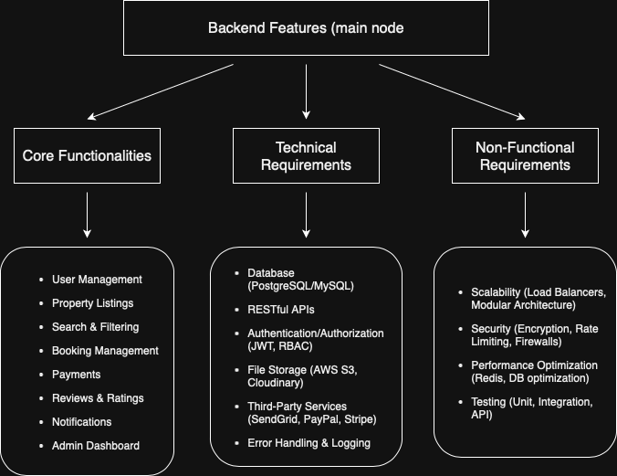

# Airbnb Clone - Features and Functionalities

This document lists the main features and backend functionalities of the Airbnb Clone project.

## Key Features
- User Authentication (Login, Register)
- Property Listing Management
- Booking and Reservation System
- Payment Integration
- User Profile Management

Below is a diagram representing the overall features of the system:

